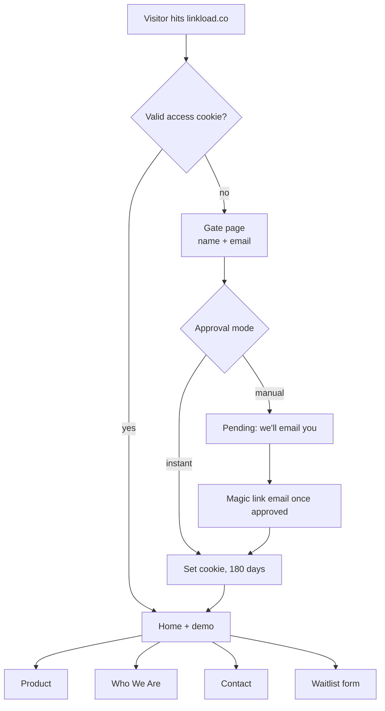
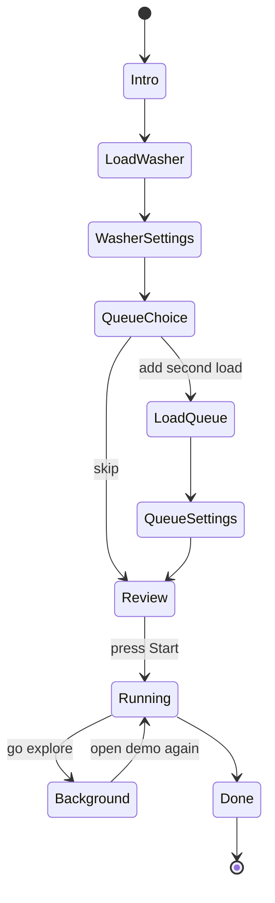

# LinkLoad Website — Design Doc & Build Plan

2026-09-16 · @u_e5Z5p6DU4OuVxYLgkhPKaw

## Summary

We replace the Webflow site with a hand-coded Next.js site on Vercel whose centerpiece is a playable LinkLoad demo, behind a name-and-email access gate. The landing page opens on the product floating in a dark, lit void (matching the demo video); one click turns that same image into an interactive machine the visitor loads, programs and starts, then watches run both loads while they browse the rest of the site.

The site does four jobs, in order of importance:

1. **Make the idea click in under a minute.** "Two loads, one touch" is easier to feel than to read, so the demo carries the pitch.
2. **Capture qualified interest.** The gate and waitlist collect contacts and tell us who they are (renter, homeowner, operator, investor).
3. **Answer the obvious questions.** Value props, FAQ, product details, who we are.
4. **Look like a premium hardware company.** Credibility for investors, advisors and cofounder candidates who get sent the link.

Why rebuild rather than fix Webflow: fluid scaling at every width, full control over animation and interaction, and a codebase Claude/Cursor can change quickly.

## Current state: how the site works today

Three separate services are involved, and only one of them is the website. Changing the website means changing a couple of DNS records at GoDaddy and nothing else.

| Piece | Where it lives | What it does | Touch during rebuild? |
| --- | --- | --- | --- |
| Domain (linkload.co) | GoDaddy | Owns the name; its DNS table points each service to the right place | Yes, only the website A/CNAME records, at cutover |
| Website | Webflow (hosted + CDN) | Serves the pages; images sit on Webflow's CDN | Replaced by Vercel; cancel the Webflow plan after cutover |
| Business email | Microsoft 365 via GoDaddy | MX, autodiscover, SPF, DMARC, SRV records | Never |
| Contact form | Webflow Forms | Submissions go to Webflow's form inbox | Replaced by our own form + database |

What [the live site](https://linkload.co/) shows today, useful as a punch list for the rebuild:

- Visiting linkload.co ends up at **www.linkload.co**, while the page declares linkload.co as canonical. Pick one (recommend the bare linkload.co) and redirect the other. Decided: linkload.co is canonical and www redirects to it.
- The "Watch demo" button links to a different YouTube video (`_igGh-44tT4`) than the one you shared (`BeLTB3nu2bY`). Decided: BeLTB3nu2bY is the current film; the new site links to it.
- "Get on the list", "Learn more" and all five social icons link to `#` (nowhere). Decided: the new site drops the "Learn more" button for now, and "Get on the list" becomes "Join the waitlist", opening the waitlist form described under Landing page.
- The page title has a typo: "The Washer-Dryer That Transfer Clothes". Decided: the new title is "LinkLoad – The Washer-Dryer That Transfers Clothes for You", used for the page title and the link-preview title.
- A leftover template image is labelled "image of commercial interior (for an interior design firm)".
- The contact heading "Let's talk socks" is a nice voice cue worth keeping.

The existing copy (six value props, five FAQs) carries over nearly as-is; edits are suggested in the Landing page section.

## Design principles and visual language

The look is "product film in a dark studio": near-black space, one lit object, silver type, and purple used only where something is alive or clickable.

### What we're taking from each reference

| Site | Borrow | Skip |
| --- | --- | --- |
| [Proxima](https://proximabio.com/) | Full-bleed looping background video; small looping animated illustrations per concept; uppercase, widely spaced nav | Long partner-logo marquee (we have no logos yet) |
| [Buoyant](https://www.trybuoyant.ai) | Scroll-driven "build" of the hero; mono technical annotations floating beside the object (coordinates, elevations); count-up stats; italic emphasis inside headlines | The dense product-UI mocks |
| [Alleviate](https://alleviatehealth.care/) | Hero that *plays out* a live sequence instead of showing a static screenshot; grainy gradient texture; a numbered 3-step "how it works" with small loops | Light-blue palette |

The LinkLoad equivalent of Buoyant's annotations: thin leader lines and mono labels on the hero, such as `QUEUE DRAWER · LOAD 02`, `TRANSFER CHUTE · FULL DIAMETER`, `DONE DRAWER`. They sell "real engineered system" in five words each.

### Principles

1. **One object, lit.** Every screen has a single focal point. No card grids fighting the product.
2. **Show, then say.** Motion explains; copy confirms in one line.
3. **Purple means alive.** The accent marks the machine's indicator light, active controls, demo arrows and focus rings. Nowhere decorative.
4. **Fluid, not breakpointed.** Type, spacing and imagery scale continuously with `clamp()`; layouts only restack when the content genuinely needs it.
5. **Weighted motion.** Slow ease-in-out camera moves, no bounce or spring overshoot on the product. Respect `prefers-reduced-motion`.
6. **Short copy.** Headlines two lines, subheads two lines, cards two sentences.

### Tokens (starting values, tune in build)

| Token | Value | Use |
| --- | --- | --- |
| `--void` | `#070708` | Page background |
| `--graphite` | `#131316` | Raised surfaces, gate card |
| `--charcoal` | `#1E1F23` | Borders, dividers |
| `--steel` | `#8E929A` | Secondary text, annotations |
| `--silver` | `#C9CCD2` | Body text |
| `--paper` | `#F3F2EF` | Headlines, primary buttons |
| `--signal` | `#8C7BFF` | The one accent (purple) |
| `--signal-glow` | `#8C7BFF` at 35% | Indicator glow, hotspot pulse |

Type: a clean grotesk for display and body plus a mono for annotations and specs. Free default is Geist Sans + Geist Mono (built for Next.js); a licensed face like PP Neue Montreal is the upgrade if budget allows. Headlines use `clamp(2.5rem, 6vw, 6rem)` with explicit line breaks.

Texture: a faint film-grain overlay (a tiny tiled noise PNG at 3-5% opacity) over the void, so gradients never band and the black feels photographic rather than flat.

## Site map and access gate

Every page sits behind a one-step gate: name + email in, a long-lived signed cookie out. Recommend **instant approval** at launch, with a manual-approval switch we can flip on later. Decided: launch in manual-approval mode to keep the site exclusive (see below).



Pages: `/access` (gate), `/` (home + demo), `/product`, `/about` (Who We Are), `/contact`, `/privacy`. The demo is an overlay on `/`, not its own page, so the camera can fly from the hero straight into it.

### How the gate works

- **First visit:** the gate shows the lit product silhouette, the logo, one line ("LinkLoad is coming. Request access.") and two fields. Submit stores the person as pending. Once approved, their magic link sets an httpOnly signed cookie (JWT, 180 days).
- **Returning, same browser:** the cookie lets them straight in. Next.js middleware checks it on every request.
- **Returning, new device or cleared cookies:** they enter their email; if it's already approved we email a one-click magic link. No passwords.
- **Manual mode (launch default):** new requests land as `pending`; you approve from a simple admin view (or directly in the Supabase table), which triggers the magic-link email. Useful if the link circulates beyond people you want seeing it.
- **Always public:** the gate page, favicon, OG image, `robots.txt`, `/privacy`, API routes.

### Approval mode: manual at launch

Manual approval adds a wait at the exact moment someone is curious, and most people who get sent the link are people you want in. Instant approval still captures every name and email; the gate's real job at this stage is lead capture and a sense of exclusivity.

**Decision:** manual approval for now, because the wait is part of the exclusivity. To keep the wait feeling like velvet rope rather than friction:

- **Make pending feel like being chosen.** After submitting, show the lit machine silhouette and "You're on the list. We review every request personally." Send an email that says the same.
- **Approve fast.** Each new request triggers an email to you with one-click Approve and Decline links, so approving takes seconds from your phone. Aim for same-day approvals.
- **Invite links skip the line.** Links you send personally (advisors, investors, cofounder candidates) carry a signed invite token that approves on arrival, so VIPs never wait.
- **Keep the switch.** Approval mode is one setting, so you can move to instant approval later without code changes.

### Gate side effects to plan for

- **Link previews still work.** Texting linkload.co shows the OG image and title, because crawlers read the public gate page's metadata.
- **Search engines see only the gate.** Fine while "coming soon"; revisit at launch.
- **The waitlist becomes enrichment, not capture.** We already know name and email from the gate, so the waitlist form pre-fills them and asks only the extra fields.

## Landing page

The home page is one long scroll in eight beats, and the hero image doubles as the demo's first frame.

| # | Section | What it does | Key interaction |
| --- | --- | --- | --- |
| 1 | Hero | Product floats in the lit void with mono annotations; headline, subhead, two buttons | Slow idle drift and light sweep; hover brightens the machine; "Try it yourself" launches the demo |
| 2 | Demo | Full-screen interactive overlay (next section) | Camera flies from the hero into the machine |
| 3 | How it works | Load → Start → Walk away, three numbered steps | Scroll-scrubbed: the machine rotates and each step lights up |
| 4 | Value props | The six existing cards | Borderless tiles, each with a 2-3 s silent loop that plays on hover or when in view |
| 5 | Comparison | LinkLoad vs 2-in-1 combo vs separate pair | Simple check/cross table, rows reveal on scroll |
| 6 | Film | The product film | Click-to-play video |
| 7 | FAQ | The five existing questions | Accordion, one open at a time |
| 8 | Waitlist | "Join the waitlist" form | Pre-filled from the gate |

### Hero composition

- **Image:** the canonical hero render, transparent or on pure `--void`, native aspect ratio, never stretched. A soft floor reflection and a top-down key light, as in the demo video.
- **Headline (keep):** "Laundry, automated. / Life, uninterrupted." Two forced lines.
- **Subhead:** "The only washer-dryer that moves your clothes for you. / Start two loads, walk away."
- **Buttons:** primary "Try it yourself" (opens demo), secondary "Watch the film".
- **Layout:** side by side above roughly 900 px, stacked below; the text block scales as one unit.

### Copy edits to the existing cards and FAQ

The current copy is good. All of it is written in the present tense, as though LinkLoad already exists.

- **Smart home sync** and the **hang-dry net** are described as if they exist. Shift to "will" or "designed to" ("We'll include a dedicated hang-dry mesh net..."). Decided: no, keep present tense; all site copy describes LinkLoad as an existing product.
- **"Faster cycles, better drying"** in the 2-in-1 answer: fine as a category claim (separate machines vs combos), but avoid specific numbers until DV testing.
- **Proof stat:** the field study reports 82% of 74 laundromat customers wanted automatic transfer; the master doc says \~76%. Pick one before it goes on the page. Decided: no stat on the site for now.

### Film embed

Use a "lite" YouTube embed: a poster image plus play button that loads the real player only on click. Keeps the page fast and avoids YouTube's tracking until the visitor opts in.

Decided: lite embed of the BeLTB3nu2bY film, with a poster frame taken from the video.

### Waitlist form

Name and email arrive pre-filled from the gate. Everything else is short, mostly optional, and chosen so the answers double as market research on the wedge question. Every waitlist button on the site reads "Join the waitlist": on the home page it scrolls here, and on other pages (and in the nav) it opens the same form in a modal.

| Field | Type | Required | Why |
| --- | --- | --- | --- |
| I am a... | Renter, homeowner, property manager, laundromat or route operator, investor, other | Yes | Splits consumer vs commercial interest |
| City / ZIP | Text | Yes | Where demand clusters; pilot siting |
| Current setup | Stacked pair, side-by-side, 2-in-1, shared laundry room, laundromat | No | Who we'd displace |
| Phone | Tel + separate SMS-consent checkbox | No | Launch texts need explicit consent |
| Age range | 18-24, 25-34, 35-44, 45-54, 55+ | No | Ranges rather than exact age |
| Gender | Woman, man, non-binary, prefer to self-describe, prefer not to say | No | Optional by design |

Include a one-line notice at collection linking to `/privacy` (California privacy law expects one when collecting personal data from CA residents), and send a confirmation email on submit.

## Interactive demo

The demo is a guided, clickable run of "two loads, one touch": about 60 seconds of setup the visitor drives, then about 50 seconds of machine lifecycle that keeps running while they browse. It is built as a state machine that plays short video clips and moves a virtual camera, with invisible click and swipe targets laid over the machine.

### Rendering approach

| Approach | How it works | Pros | Cons |
| --- | --- | --- | --- |
| **A. 2.5D (recommended for v1)** | High-res stills and short clips of the machine, stacked in layers; camera moves are CSS scale/translate driven by Framer Motion; controls are HTML hotspots positioned in % over the image | Uses the demo-video look directly; fast to build; tiny runtime; works on every phone | Every angle must exist as an asset; AI clips can drift from the true geometry |
| B. Real-time 3D | CAD exported to glTF, rendered with react-three-fiber; doors, drums and camera animated in code | Free camera, perfect geometric consistency, one model feeds every shot | Needs a clean, light CAD export and lighting work; heavier on low-end phones |

Start with A. If Ahmed's CAD can be exported as a clean, decimated GLB, B becomes a strong v2 and the same state machine drives it unchanged.

**Decision:** build v1 with A as a stitched frame-to-frame clip system. Each interaction is a short Flow clip generated between a start frame and an end frame, and the clips chain because each one's end frame is the next one's start frame. Three.js is reserved for a later version built on the real 3D CAD.

- **Triggers:** invisible click and swipe targets sit over the machine. A click plays the matching clip, then holds on its end frame until the next input.
- **Button pad:** each button press is its own short clip (press, light on), handled the same way.
- **Knob:** instead of a fixed clip, a single rotation clip is scrubbed frame by frame with the scroll wheel or swipe, so the knob follows the visitor's hand and stops wherever they stop.
- **Keep the state count small.** Every visible panel state needs its own frames, so limit v1 to about four knob positions and two or three buttons, each lighting independently.
- **Text as an overlay.** AI video renders lettering poorly, so cycle names and timers on the panel display are a thin HTML layer on top of the clip.
- **Seam check:** join clips on exactly matching frames, and cross-fade 2-3 frames where a generation drifts slightly.

### Flow



The X button (and Esc) exits from any state; Running and Background keep their clock, so leaving never breaks the story.

### Setup beats (visitor-driven)

| Beat | Camera | Visitor does | Guidance on screen |
| --- | --- | --- | --- |
| Intro | Push in from hero to three-quarter view | Nothing (2 s) | "Let's do laundry." |
| Load washer | Medium on washer door | Click (or drag) the clothes pile into the open door; door closes | Pulsing purple ring on the door |
| Washer settings | Close-up on control panel | Scroll or drag to turn the knob to a cycle; tap temperature and spin buttons | Arrows point at the next control; the knob's label updates live |
| Queue choice | Pull back to full machine | Choose "Add a second load" or "Just one" | Two buttons, plus one line on what the Queue Drawer is |
| Load queue | Medium on Queue Drawer; drawer slides open | Drop the second pile in; drawer closes | Ring on the drawer |
| Queue settings | Close-up on panel, second-load tab active | Same controls as washer settings | Panel shows "Load 2" |
| Review + Start | Close-up on Start button | Press Start | Button glows; summary chip "Load 1: Normal · Load 2: Delicates" |

### Lifecycle beats (automatic, timed)

Durations assume your \~10 s per cycle; total is about 47 s with a queued load, 27 s without.

| Beat | Duration | Camera | Machine does |
| --- | --- | --- | --- |
| Wash load 1 | 10 s | Wide, slow orbit | Washer drum tumbles; panel timer counts down |
| Transfer 1 | 4 s | X-ray cutaway | Drum segments and divider retract; clothes drop down the chute into the dryer; reseal |
| Queue drop | 3 s | Cutaway, upper half | Load 2 falls from the Queue Drawer into the washer |
| Dry 1 + Wash 2 | 10 s | Wide | Both drums run in parallel (the key "no combo can do this" moment) |
| Load 1 to Done Drawer | 3 s | Cutaway, lower half | Dry load 1 drops into the Done Drawer |
| Transfer 2 | 4 s | Cutaway | Load 2 moves washer to dryer |
| Dry load 2 | 10 s | Wide | Dryer runs |
| Finish | 3 s | Push in on panel | Dryer stops with load 2 resting inside; load 1 waits in the Done Drawer. "Both loads done." Indicator turns steady purple |

### "Go explore" background mode

Right after Start, a line appears: "Go explore. We'll let you know when they're ready." The overlay shrinks into a floating pill (bottom-right) with two small progress rings, Load 1 and Load 2, styled like a phone notification.

- Toasts fire at each milestone: "Load 1 is in the dryer", "Load 2 started washing", "Both loads are done".
- Clicking the pill reopens the full demo at the current moment.
- The timeline runs off wall-clock time, not video playback, so it stays correct while clips are off-screen.
- This quietly demonstrates the "smart home sync" card without a separate section.

### Controls and edge cases

- **Always visible:** X (close), restart, mute, and a thin progress rail of the beats.
- **Skip option:** "Just watch" on the intro plays setup with default choices, for people who don't want to click.
- **Scroll wheel on the knob:** capture wheel events only while the pointer is over the knob, so the page doesn't scroll unexpectedly. Touch devices use horizontal drag; keyboard uses arrow keys.
- **Mobile:** portrait framing, bigger hotspots (44 px minimum), same beats.
- **Reduced motion:** camera moves become cross-fades; clips still play.
- **Slow connections:** preload only the next beat's clip; show the still frame until it's ready.

### What we need from your storyboard

For each beat above: the trigger, camera framing, the clip or still to show, overlay UI, on-screen copy, and duration. Also the control panel's real layout (knob position, which buttons exist and their icons), since every button and knob state needs its own start and end frames.

## Other pages

Each secondary page is short, one scroll, and ends with the same waitlist or contact prompt.

### Who We Are (`/about`)

The story is "the problem isn't the machines, it's the gap between them", told from the dossier in three blocks. No team or founder section for now; the page is about the idea, not the people.

1. **The insight.** Washers and dryers each work well. The waste is the idle time between them, when clothes sit waiting for a person. We call it inter-cycle idle time.
2. **What we heard.** We interviewed 74 laundromat customers and 5 owners across West LA and Santa Monica. Most people stay on-site for 1-2 hours per visit, and a strong majority want the transfer automated.
3. **Our approach.** Keep two full-capacity machines and automate the handoff with gravity and a retractable drum, not robotics. Reliability over novelty.

Draft opener: "Laundry isn't hard. It's interrupted. LinkLoad exists to remove the one step that keeps you home."

### Product (`/product`)

An Apple-style product page: hero angle, exploded view, feature rows, specs table, where we are.

- **Anatomy:** a swipe-through tour of the machine's key parts. Swiping left or right on a trackpad (or dragging on touch, or using arrow keys) moves through six stops: Queue Drawer, washer and split drum, control panel, transfer chute and divider, dryer, Done Drawer. At each stop the camera glides to that part, the rest of the machine dims or pulls apart in an exploded view, and a mono leader-line label plus one sentence appears. Dots underneath show progress, and the tour snaps to each stop so a hard swipe never skips past a part. It reuses the demo's camera and hotspot system.
- **Features:** the six value props expanded to a paragraph each, each with its loop.
- **Specs:** capacity, dimensions, power, water hookup and connectivity, presented as product specs (filled with our target values).
- **Pricing:** internal hypothesis is a premium appliance in roughly the $2,000-$4,000 range. Decided: show "$3,999 MSRP" beside a "Join the waitlist" button (no Buy button). The price lives in a single site config value so it can change in one place.
- **Where we are:** replaced by an "Availability" block: "Patent pending. Join the waitlist for early access." No prototype or development talk.

### Contact (`/contact`)

Keep "Let's talk socks" as the headline.

- **Form:** name and email (pre-filled), topic, message. Topics: General, Commercial pilots (laundromats, property managers, dorms), Investors, Press, Join the team.
- **Routing:** every message is stored and emailed to jarett@linkload.co with the topic in the subject line, so pilot and investor inquiries are easy to filter.
- **Direct line:** show the email address for people who'd rather write directly.

## Technical architecture

Next.js on Vercel, Supabase for data, Resend for email: every piece has a free tier that covers this stage, and none of it touches the Microsoft email records.

```mermaid
flowchart LR
    U[Visitor] --> VC[Vercel<br/>Next.js site]
    VC --> MW[Middleware<br/>cookie check]
    VC --> API[API routes]
    API --> SB[(Supabase<br/>Postgres)]
    API --> RS[Resend<br/>transactional email]
    RS --> IN[jarett@linkload.co]
    GH[GitHub repo] --> VC
    DNS[GoDaddy DNS] --> VC
```

| Layer | Choice | Notes |
| --- | --- | --- |
| Framework | Next.js (App Router) + TypeScript | Same stack Proxima, Buoyant and Alleviate use |
| Styling | Tailwind CSS + CSS variables for tokens | `clamp()` utilities for fluid type and spacing |
| Animation | Framer Motion (now published as `motion`) | Camera moves, scroll-scrubbed sections, layout transitions |
| Demo logic | XState, or a typed reducer | Explicit states make the storyboard easy to edit |
| 3D (only if option B) | react-three-fiber + drei | Loads a GLB exported from CAD |
| Data | Supabase Postgres | Tables below; row-level security on |
| Email | Resend | Magic links, waitlist confirmation, contact notifications; needs its own DNS records on a sending subdomain |
| Analytics | Vercel Analytics + PostHog | PostHog tracks the demo funnel beat by beat |
| Hosting | Vercel, deploys from GitHub `main` | Preview URL for every branch |
| Media | Self-hosted MP4/WebM in `/public` or Vercel Blob | Mux only if clips get long |

### Data model

| Table | Fields | Written by |
| --- | --- | --- |
| `visitors` | id, name, email (unique), status (approved / pending / blocked), created\_at, last\_seen\_at, source | Gate |
| `waitlist` | visitor\_id, role, city\_zip, setup, phone, sms\_consent, age\_range, gender, created\_at | Waitlist form |
| `messages` | visitor\_id, topic, body, created\_at | Contact form |
| `demo_events` | visitor\_id, beat, action, settings, created\_at | Demo (optional; PostHog can cover this) |

### Email DNS caution

Resend needs a few records (SPF include, DKIM) to send as LinkLoad. Put them on a subdomain such as `send.linkload.co` so they can't collide with the Microsoft SPF record on the root. Never edit the existing MX, autodiscover, SPF, DMARC or SRV records.

## Asset pipeline

Keep Whisk and Flow, but replace the GIF step with MP4/WebM video, and anchor every generated asset to one locked master image so the machine never changes shape between shots.

### Why not GIF

GIF is limited to 256 colors, so dark gradients and soft studio light band into visible stripes, which is exactly our look. It is also huge: a 10-second, 30 fps, 1080p GIF typically runs tens of megabytes, where the same clip as H.264 MP4 is usually 2-5 MB. Browsers autoplay muted, inline MP4 exactly like a GIF. Use ffmpeg (free, one command per clip) or HandBrake instead of ezgif.

### Keeping the machine consistent

AI image and video tools drift: a second control panel appears, the housing gains a seam, the drums move. For a hardware company, a demo that contradicts its own design is a credibility problem.

1. **Lock a master still** taken from the demo video (Whisk only to clean up or fill gaps) that meets every hero requirement (one housing, one panel between the drums, Queue Drawer on top, Done Drawer at the bottom, three-quarter angle facing left).
2. **Generate every clip from that still** (or from frames pulled out of the demo video) as the start frame in Flow, and use matching start and end frames for anything that loops.
3. **Shoot everything on the same pure-black void with the same key light.** Then layers composite with no transparency, which avoids the messy Safari/Chrome alpha-video split.
4. **Mechanism shots come from real sources.** Transfer cutaways should be taken from the demo video or a CAD animation (Paul offered to animate), not generated, because AI will invent a mechanism that isn't yours.
5. **Reject any frame that breaks the geometry rules**, even if it looks great.

### Decision: every asset starts from demo-video stills

All stills and clip start/end frames come from the demo video, which gives the most consistent machine possible. For this to work:

- **Pull frames from the original export, not YouTube.** YouTube re-compresses heavily. Get the master file from whoever edited the film and export PNG frames with ffmpeg.
- **Resolution limits zoom.** Push-ins to the control panel magnify the frame 2-3x, so a 1080p source goes soft. Use a 4K master if one exists; otherwise upscale the close-up frames (an AI upscaler, or a Whisk re-render of that crop).
- **Pick clean frames.** Avoid motion blur, title overlays and mid-transition frames.
- **Fill gaps from neighbors.** Any state the film never shows (a lit button, portrait framing, the second load's colorway) gets generated in Flow between the two nearest real stills.
- **Confirm ownership.** If a contractor made the film, make sure LinkLoad holds the rights to reuse the footage.

### Asset list

| Asset | Source | Output | Notes |
| --- | --- | --- | --- |
| Master hero still | Whisk, then retouch | PNG/AVIF, 3000 px tall | Also crops for the gate, OG image (1200 x 630) and favicon |
| Hero idle loop | Flow, from master | MP4 + WebM, 6-8 s seamless | Light sweep, subtle drift |
| Door, drawer and knob stills | Whisk, from master | PNG/AVIF | Open and closed states for each, plus six exploded/isolated stills for the Product page anatomy tour (ideally from CAD) |
| Control panel | Flow, frame-to-frame from master | MP4 + WebM, under 1 s per press | One clip per button press plus one scrubbable knob-rotation clip; display text is an HTML overlay; needs your real layout |
| Tumble loops (washer, dryer, both) | Flow or demo video | MP4 + WebM, 2-4 s | Seamless |
| Transfer and drawer-drop cutaways | Demo video or CAD animation | MP4 + WebM | Five clips: transfer 1, queue drop, done drop, transfer 2, finish |
| Value-prop loops (x6) | Cut from the above | MP4, 2-3 s, small | Reuse, don't generate new |
| Clothes piles | Whisk | Transparent PNG | Two distinct colorways, so Load 1 and Load 2 are easy to tell apart |
| Film | Existing YouTube video | Embed | Video ID BeLTB3nu2bY |

### Encoding targets

Full-screen clips at 1920 x 1080 (and a 1080 x 1920 portrait cut for phones), H.264 MP4 plus VP9 or AV1 WebM, no audio track, `muted playsinline loop` where looping, and a poster frame for each. Aim for under 3 MB per clip.

## Plan of action

Build in eight phases over roughly five to seven part-time weeks, and build the demo with grey placeholder boxes *before* generating final assets, so you only make the clips the finished interaction actually needs.

### Fast track: v1 live in two full days

Ship a polished site with the film as the hero in two days, then build the interactive demo as v2 without time pressure. The phases table below becomes the v2 plan.

**Hero video, done well:** a YouTube embed can only autoplay muted, and its player chrome, logo and end-screen suggestions look cheap in a dark premium hero. Better: a self-hosted, muted, looping 10-20 s cut of the film as the hero background (needs the original video file), with a "Watch the film" button opening the full video with sound. If the source file isn't available by day 1, fall back to a muted YouTube embed with controls hidden and looping on, and swap it later.

**Gate, simplified for speed:** keep manual approval, but lean on invite links. Everyone you're about to contact gets a personal link that approves them on arrival, so the people who matter this week never wait. Strangers use the request form, and you approve them from the email you receive. The admin view waits for v2.

#### Day 1: build the site

- [ ] Accounts: GitHub, Vercel, Supabase, Resend
- [ ] Gather the logo SVG, the original film file, and 2-3 hero stills
- [ ] Scaffold Next.js with tokens, fonts, nav and footer
- [ ] Home: video hero, value props (static stills, no loops yet), comparison table, film section, FAQ, waitlist form
- [ ] Trim and encode the hero loop with ffmpeg
- [ ] Deploy to a Vercel preview URL and click through it on your phone

#### Day 2: gate, pages, launch

- [ ] Access gate: request form, approve-by-email, invite links, magic link, cookie
- [ ] Waitlist and contact forms writing to Supabase and emailing you
- [ ] Simple Who We Are, Product (static images, no anatomy tour) and Contact pages, plus Privacy
- [ ] Title, description, OG image and favicon
- [ ] QA at phone, tablet and desktop widths; iPhone Safari autoplay check
- [ ] Morning of day 2: point DNS at Vercel (following the launch checklist below) so it has hours to propagate
- [ ] Generate invite links for your outreach list and send

#### Deferred to v2

The interactive demo and its background status pill, the hero annotations and scroll-scrubbed "How it works", value-prop loops, the Product page anatomy swipe tour, the admin approval view, and PostHog funnel tracking. When the demo ships, the film moves down the page and the hero becomes the demo's first frame.

| Phase | What happens | Tools | Output | Est. time |
| --- | --- | --- | --- | --- |
| 0. Setup | Create accounts; gather logo (SVG), demo video source file, CAD exports, control panel layout | GitHub, Vercel, Supabase, Resend, PostHog | Accounts + asset folder | 1 day |
| 1. Storyboard | Write the frame-by-frame for every demo beat using the template in the demo section | Doc, or Figma/FigJam | Locked beat sheet | 2-3 days |
| 2. Scaffold | Next.js project, tokens, fonts, layout, nav, footer, static pages with real copy and placeholder images | Cursor or Claude Code | Site running locally | 3-4 days |
| 3. Gate + forms | Access gate, middleware, magic links, waitlist, contact, privacy page | Claude Code, Supabase, Resend | Working lead capture on a preview URL | 3-4 days |
| 4. Demo greybox | State machine, camera moves, hotspots, control panel, timers, background pill, toasts, using grey rectangles | Claude Code, Framer Motion, XState | Fully playable demo with no final art | 1 week |
| 5. Assets | Master still, then only the stills and clips the greybox proved necessary; encode | Whisk, Flow, demo video, ffmpeg | Final media set | 1-2 weeks, overlaps phase 4 |
| 6. Integrate + polish | Swap assets in, tune timing and easing, hero annotations, scroll sections | Claude Code, Framer Motion | Near-final site | 1 week |
| 7. QA | Test every width from 360 px to 2560 px, iPhone Safari autoplay, reduced motion, keyboard-only demo, Lighthouse, link previews | Browser devtools, real phones, Lighthouse, opengraph.xyz | Punch list closed | 2-3 days |
| 8. Launch | Add domains in Vercel, swap only website DNS records at GoDaddy, verify SSL and email, cancel Webflow | Vercel, GoDaddy | linkload.co live | 1 day + DNS wait |

### Working with Claude Code or Cursor

- **Give it this doc and the ChatGPT handoff** as project context (a `CLAUDE.md` in the repo root works well).
- **One phase per session**, each ending with a commit and a Vercel preview you click through.
- **Ask for components, not pages:** `<Hero>`, `<DemoOverlay>`, `<ControlPanel>`, `<StatusPill>`, `<AccessGate>`. They stay reusable across pages.
- **Hand it real files.** Logo, renders and copy go in the repo; tell it never to invent substitutes.
- **Store beat timings and hotspot coordinates in one config file**, so tuning the demo never means digging through components.

### Launch-day DNS checklist

- [ ] Preview URL approved on desktop and phone
- [ ] Add `linkload.co` and `www.linkload.co` in Vercel; set linkload.co as primary
- [ ] At GoDaddy, change only the website A and www CNAME records to the values Vercel shows at that moment
- [ ] Leave MX, autodiscover, SPF, DMARC, SRV, `msoid`, `sip`, `lyncdiscover` and the Microsoft TXT untouched
- [ ] Add Resend's records on the sending subdomain
- [ ] Confirm SSL on both hostnames, and that www redirects to the root
- [ ] Send and receive a test email
- [ ] Text yourself the link to check the preview card
- [ ] Remove the `_webflow` TXT record and cancel the Webflow site plan

## Open decisions

- [x] **Gate mode:** instant approval or manual approval? Decided: manual, with invite links that skip the line.
- [x] **Audience emphasis:** the dossier says commercial first (laundromats, dorms, multifamily) while this site reads consumer-premium. Keep consumer as the face, with a "Commercial pilots" path on Contact? Decided: consumer premium is the target; all copy, imagery and the waitlist speak to homeowners and renters first.
- [x] **Where does load 2 end up?** The FAQ says load 1 drops into the Done Drawer; does load 2 also drop there, or stay in the dryer? The demo's final beat depends on it. Decided: load 2 stays in the dryer.
- [x] **Survey stat:** 82% (field study) or \~76% (master doc)? Decided: no stat on the site.
- [x] **Which film is current:** `_igGh-44tT4` (on the site now) or `BeLTB3nu2bY`? Decided: BeLTB3nu2bY.
- [x] **Control panel design:** real layout, knob positions and button icons.
- [x] **Rendering path:** 2.5D now, or is a clean CAD export ready for real-time 3D? Decided: 2.5D for now; move to the 3D CAD export soon after.
- [ ] **Pricing on the Product page:** number, range, or "premium" wording only? Decided: $3,999 MSRP (current number, may change).
- [ ] **Named advisors on Who We Are:** who has agreed to be listed? Decided: no team or advisor section for now.
- [ ] **Font:** free Geist, or license a display face? Decided: Geist Sans + Geist Mono.
